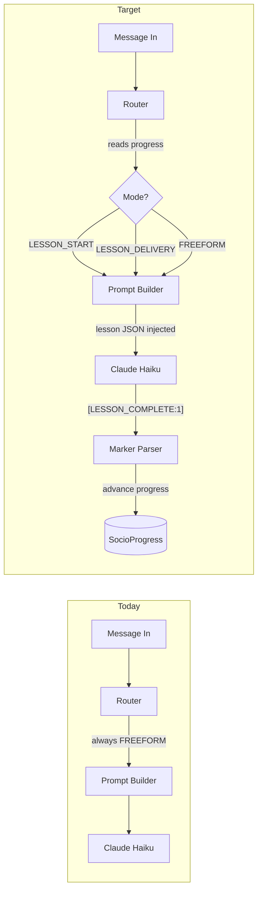
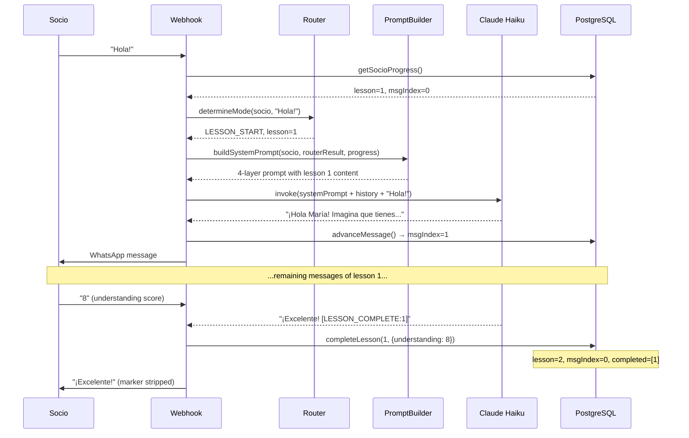

# Lesson Delivery Pipeline

## Current State

The 4-layer prompt system is fully built but inert. The router in [prompts/router.ts](apps/web/src/lib/ai/prompts/router.ts) always returns `FREEFORM_QUESTION` because nothing provides `SocioProgress` data. The `LESSON_DELIVERY`, `LESSON_START`, and `RETEACH` task prompts in [prompts/layers/task.ts](apps/web/src/lib/ai/prompts/layers/task.ts) are dead code.




## Step 1: Structure Lessons 1-5 into JSON

Create [src/lib/lessons/data.ts](apps/web/src/lib/lessons/data.ts) with a `LessonData` type and hardcoded JSON for lessons 1-5. The raw curriculum is in [data/curriculum/mentors_manual_key_points.txt](apps/web/data/curriculum/mentors_manual_key_points.txt) -- each lesson already has clearly marked REFLECTION, KEY CONCEPTS, EXERCISE, and COMMITMENT sections.

**Type definition:**

```typescript
export interface LessonMessage {
  order: number;
  type: 'escenario' | 'explicación' | 'ejemplo' | 'pregunta';
  contentEs: string;
}

export interface LessonData {
  lessonNumber: number;
  titleEs: string;
  category: string;
  keyConcepts: string[];
  selfCheckQuestions: string[];
  exercise: string;
  commitment: string;
  messages: LessonMessage[];
}
```

**Message count is per-lesson, not fixed.** Each lesson's `messages[]` array defines how many messages that lesson uses -- the router and builder read `lesson.messages.length` dynamically. Simpler lessons (e.g. Lesson 2: Separate Entities) might use 3 messages; complex ones (e.g. Lesson 5: Break-Even with 3 business models) might use 5-6. The suggested message types are a starting framework, not a constraint:

- `escenario`: Hook the socio with a relatable everyday scenario
- `explicación`: Teach key concepts from the curriculum
- `ejemplo`: Walk through the exercise with a concrete example
- `pregunta`: Ask them to apply it + state the commitment
- `profundización`: Go deeper on a sub-topic (used when a lesson warrants extra messages)

**Exported functions:**

- `getLessonData(lessonNumber: number): LessonData` -- returns the lesson or throws
- `getLessonTitle(lessonNumber: number): string` -- used by the context layer (replaces the current `LESSON_TITLES` record in [layers/context.ts](apps/web/src/lib/ai/prompts/layers/context.ts))

The content for each message should be 2-3 sentences in Colombian Spanish -- enough to guide the AI but short enough that the AI adapts it naturally to the socio's context.

**5 lessons to structure:**

- Lesson 1: Registros Financieros (Financial Records)
- Lesson 2: Entidades Separadas (Separate Entities)
- Lesson 3: Presupuesto del Negocio (Business Budget)
- Lesson 4: Ahorro (Saving)
- Lesson 5: Punto de Equilibrio (Break-Even Point)

## Step 2: Add SocioProgress to the Database

**New Prisma model** in [schema.prisma](apps/web/prisma/schema.prisma):

```prisma
model SocioProgress {
  id                    String   @id @default(uuid())
  socioId               String   @unique @map("socio_id")
  currentLessonNumber   Int      @default(1) @map("current_lesson_number")
  currentMessageIndex   Int      @default(0) @map("current_message_index")
  completedLessons      Int[]    @default([]) @map("completed_lessons")
  weeklyUnderstanding   Int?     @map("weekly_understanding")
  weeklyImplementation  Int?     @map("weekly_implementation")
  lastLessonCompletedAt DateTime? @map("last_lesson_completed_at")
  createdAt             DateTime @default(now()) @map("created_at")
  updatedAt             DateTime @updatedAt @map("updated_at")

  socio Socio @relation(fields: [socioId], references: [id])

  @@map("socio_progress")
}
```

Add the reverse relation on `Socio`: `progress SocioProgress?`

**New repo types** in [repo/types.ts](apps/web/src/lib/repo/types.ts):

```typescript
export type SocioProgress = {
  id: string;
  socioId: string;
  currentLessonNumber: number;
  currentMessageIndex: number;
  completedLessons: number[];
  weeklyUnderstanding: number | null;
  weeklyImplementation: number | null;
  lastLessonCompletedAt: Date | null;
};
```

**New repo methods** (added to the `Repo` interface and [prismaRepo.ts](apps/web/src/lib/repo/prismaRepo.ts)):

- `getSocioProgress(socioId: string): Promise<SocioProgress>` -- returns progress, creates default if none exists
- `advanceMessage(socioId: string): Promise<SocioProgress>` -- increments `currentMessageIndex` by 1
- `completeLesson(socioId: string, lessonNumber: number, scores: { understanding?: number; implementation?: number }): Promise<SocioProgress>` -- adds lesson to `completedLessons`, increments `currentLessonNumber`, resets `currentMessageIndex` to 0, saves scores, sets `lastLessonCompletedAt`
- `initProgress(socioId: string): Promise<SocioProgress>` -- creates the initial progress record (called during onboarding)

**Migration:** Run `npx prisma migrate dev --name add_socio_progress`

**Update onboarding:** In [onboarding/service.ts](apps/web/src/lib/onboarding/service.ts), when a socio transitions to `ACTIVE`, call `repo.initProgress(socio.id)` to create their progress record.

## Step 3: Wire Lesson Delivery into the Webhook

Three files change:

### 3a. Update the Router ([prompts/router.ts](apps/web/src/lib/ai/prompts/router.ts))

The router currently ignores progress. Change `determineMode` to:

1. Accept the incoming message text as a second parameter
2. Call `repo.getSocioProgress(socio.id)` to get real progress
3. Load the lesson data via `getLessonData(progress.currentLessonNumber)`
4. Apply this priority logic:

```
if progress.currentMessageIndex > 0 AND < lesson.messages.length:
  → LESSON_DELIVERY (mid-lesson)
  Special case: if on last message and user sent a score <= RETEACH_THRESHOLD → RETEACH

if progress.currentMessageIndex == 0 AND currentLessonNumber <= 5:
  → LESSON_START (ready for next lesson)

else:
  → FREEFORM_QUESTION
```

**Configurable threshold:** The reteach trigger score is defined as a constant `RETEACH_THRESHOLD` (default: `3`) in a shared constants file (`src/lib/ai/prompts/constants.ts`). This makes it easy to adjust during testing -- bump it to 4 or 5 to trigger reteaching more aggressively, or lower it to 2 for a lighter touch. The router, task prompt builder, and checkin prompt all reference this single value.

1. When returning `LESSON_START` or `LESSON_DELIVERY`, populate the `RouterResult.lesson` field with a full `LessonDeliveryState` built from the JSON data -- this is what the builder and content layer consume

### 3b. Update the AI Service ([ai/service.ts](apps/web/src/lib/ai/service.ts))

- Pass `incomingText` to `determineMode` so the router can parse scores
- Pass the `SocioProgress` from the router result to `buildSystemPrompt` so Layer 2 (context) and Layer 4 (content) get real data

### 3c. Update the Webhook ([webhook/meta/route.ts](apps/web/src/app/api/webhook/meta/route.ts))

When the marker parser finds `lessonsCompleted`, actually advance progress:

```typescript
for (const lessonNum of aiResponse.markers.lessonsCompleted) {
    await repo.completeLesson(socio.id, lessonNum, {});
}
```

Also advance the message index after each AI response in a lesson delivery context. The simplest approach: have `generateAIResponse` return the resolved `InteractionMode` alongside the text, so the webhook knows whether to call `advanceMessage`.

### 3d. Score Parsing in the Webhook

When the marker parser catches `[LESSON_COMPLETE:N]`, the webhook should also look at the recent conversation to extract the understanding and implementation scores the socio gave. Use the existing `parseScore()` function from the router module on the user's last 1-2 messages. Pass the parsed numbers to `repo.completeLesson(socio.id, lessonNum, { understanding: score })` instead of empty `{}`. This means the `SocioProgress` table has real data from day one.

### 3e. `MAX_LESSON_NUMBER` Constant

Add `MAX_LESSON_NUMBER = 5` to [constants.ts](apps/web/src/lib/ai/prompts/constants.ts). The router uses this to decide whether to start a new lesson or fall back to `FREEFORM_QUESTION`. When lessons 6-28 are structured later, bump the number. Keeps the boundary explicit and avoids the router trying to load lesson data that doesn't exist.

## Step 4: Seed Script and Test Endpoint

### 4a. Seed Script ([prisma/seed.ts](apps/web/prisma/seed.ts))

Insert the core system prompt (Layer 1 text from [layers/core.ts](apps/web/src/lib/ai/prompts/layers/core.ts)) into the `SystemPrompt` table with `version: "1.0"`, `category: "core"`, `active: true`. This means the prompt can eventually be loaded from the DB instead of the constant, enabling version management and A/B testing without code deploys. Add a `"prisma": { "seed": "npx tsx prisma/seed.ts" }` entry to `package.json`.

### 4b. Test Endpoint Enhancement ([api/test-ai/route.ts](apps/web/src/app/api/test-ai/route.ts))

Expand the existing test endpoint to accept optional fields in the POST body:

```typescript
{
  message: string;
  mode?: InteractionMode;         // override router decision
  lessonNumber?: number;          // fake progress
  messageIndex?: number;          // fake progress
  completedLessons?: number[];    // fake progress
}
```

When `mode` is provided, skip the router entirely and build a `RouterResult` directly from the supplied fields. This lets you test `LESSON_START` for lesson 3, or `LESSON_DELIVERY` at message index 2, without needing a real socio in the database. Invaluable for prompt iteration.

## What NOT to Build

- **ProgramConfig table** -- hardcode `maxLessonsPerDay = 1`, `lessonsPerWeek = 2` as constants
- **Check-in service** -- skip for now; lessons come first
- **Mentor dashboard** -- no UI until the bot teaches
- **Lessons 6-28** -- 5 is enough for the pilot; same JSON shape scales to all 28

## End-to-End Flow After Implementation




